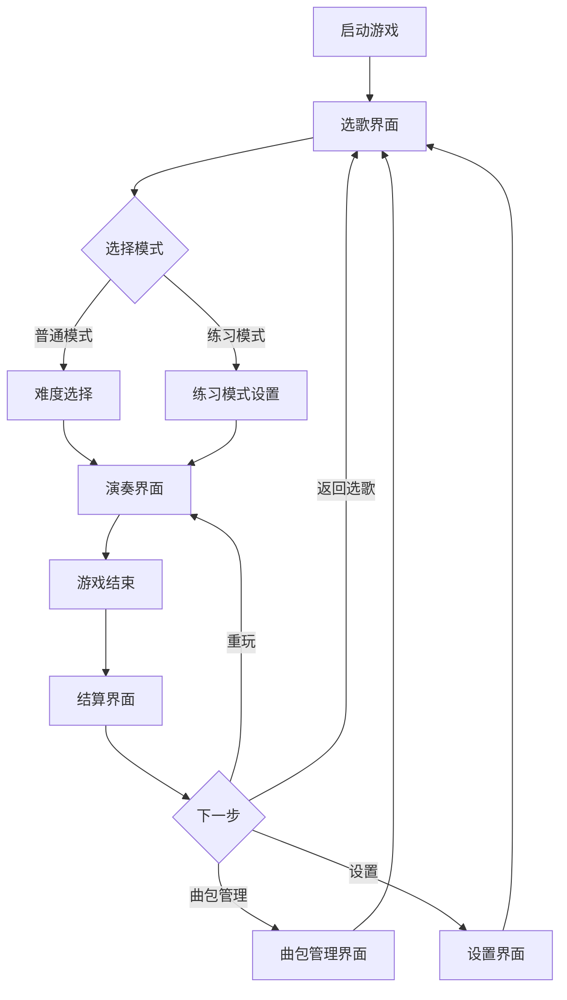

## 1. 产品概述

复古街机厅风格的音乐节奏桌面游戏，玩家通过键盘或控制器挑战本地曲包，体验经典街机音游的快感。
- 面向喜欢音乐节奏游戏的玩家，提供本地曲库管理、多难度挑战、练习模式等完整功能
- 打造沉浸式复古街机体验，结合现代音游的判定系统和个性化设置

## 2. 核心功能

### 2.1 用户角色
| 角色 | 注册方式 | 核心权限 |
|------|----------|----------|
| 玩家 | 本地使用，无需注册 | 所有游戏功能、本地数据管理 |

### 2.2 功能模块
1. **选歌界面**: 歌曲列表、封面展示、BPM显示、难度选择
2. **难度选择**: 多难度谱面、四键/六键切换
3. **演奏界面**: 音符下落、实时判定、连击计数、分数显示、能量条
4. **结算界面**: 成绩统计、判定分布、个人最佳、评级展示
5. **曲包管理**: 扫描本地歌曲、导入谱面、曲包信息
6. **练习模式**: 分段练习、循环困难小节、速度调节
7. **设置界面**: 按键映射、音量调节、延迟校准、下落速度

### 2.3 页面详情
| 页面名称 | 模块名称 | 功能描述 |
|---------|---------|---------|
| 选歌界面 | 歌曲列表 | 滚动展示所有可用歌曲，显示封面、标题、BPM、难度 |
| 选歌界面 | 搜索筛选 | 按曲包、难度、BPM 筛选歌曲 |
| 难度选择 | 谱面预览 | 显示谱面密度、难度等级、音符数量 |
| 难度选择 | 键位切换 | 四键/六键模式切换 |
| 演奏界面 | 游戏区域 | Canvas 渲染下落音符、判定线、按键轨道 |
| 演奏界面 | HUD 显示 | 实时分数、连击数、判定反馈、能量条 |
| 演奏界面 | 暂停菜单 | 暂停、继续、重新开始、退出 |
| 结算界面 | 成绩展示 | Perfect/Good/Miss 数量、最大连击、最终分数、评级 |
| 结算界面 | 成绩曲线 | 可视化展示整首歌曲的判定分布曲线 |
| 曲包管理 | 本地扫描 | 扫描指定目录的歌曲和谱面文件 |
| 曲包管理 | 谱面导入 | 导入玩家自制谱面（支持 .osu/.bms/.json 格式） |
| 练习模式 | 段落选择 | 选择歌曲中的特定段落进行练习 |
| 练习模式 | 循环练习 | 自动循环困难小节，支持调速 |
| 设置界面 | 按键映射 | 自定义各轨道的按键绑定 |
| 设置界面 | 音频设置 | 主音量、音乐音量、音效音量调节 |
| 设置界面 | 游戏设置 | 下落速度、输入延迟校准、判定窗口调节 |

## 3. 核心流程

## 4. 用户界面设计

### 4.1 设计风格
- **主色调**: 霓虹粉 (#FF2D95)、霓虹青 (#00F5FF)、霓虹紫 (#9D00FF)、深黑背景 (#0A0A0F)
- **辅助色**: 警告红 (#FF3B3B)、成功绿 (#00FF88)、金色评级 (#FFD700)
- **按钮风格**: 霓虹发光边框、像素感圆角、悬停时脉冲发光效果
- **字体**: Press Start 2P (像素字体) 用于标题，Orbitron 用于数据展示，VT323 用于正文
- **布局风格**: CRT 扫描线效果、网格背景、故障艺术 (Glitch) 转场动画
- **视觉效果**: 霓虹发光、CRT 弯曲边缘、扫描线、像素化过渡、粒子特效

### 4.2 页面设计概述
| 页面名称 | 模块名称 | UI 元素 |
|---------|---------|---------|
| 选歌界面 | 歌曲列表 | 卡片式布局、封面发光、滚动视差、选中时霓虹高亮 |
| 演奏界面 | 游戏区域 | 垂直轨道、发光判定线、下落音符带拖尾、击中粒子爆炸 |
| 演奏界面 | HUD | 左上分数、右上连击、底部能量条、判定文字漂浮动画 |
| 结算界面 | 成绩展示 | 大字号评级、判定统计柱状图、成绩曲线可视化 |
| 设置界面 | 选项面板 | 滑块带发光效果、按键绑定可点击修改、保存按钮脉冲 |

### 4.3 响应性
- 桌面端优先设计，支持窗口化和全屏模式
- 最低分辨率支持 1280x720，推荐 1920x1080
- 自适应不同屏幕尺寸，保持游戏区域比例

## 5. 游戏规格

### 5.1 判定系统
- **Perfect**: ±50ms，100% 分数
- **Good**: ±120ms，50% 分数
- **Miss**: 超过 ±120ms 或未击中，0 分并断连

### 5.2 评分系统
- 基础分 = 每个音符基础分 × 判定倍率
- 连击加成 = 连击数 × 0.1（最高 2x 加成）
- 能量条：初始 50%，Perfect +2%，Good +1%，Miss -5%，归零则失败

### 5.3 键位配置（默认）
- **四键模式**: D, F, J, K
- **六键模式**: S, D, F, J, K, L
- **特殊键**: Space (暂停), Esc (退出), Enter (确认)
