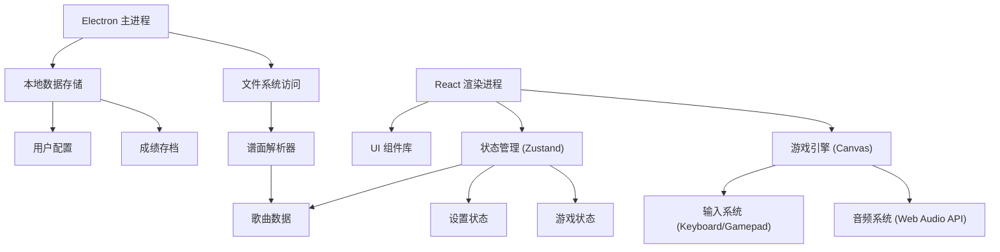
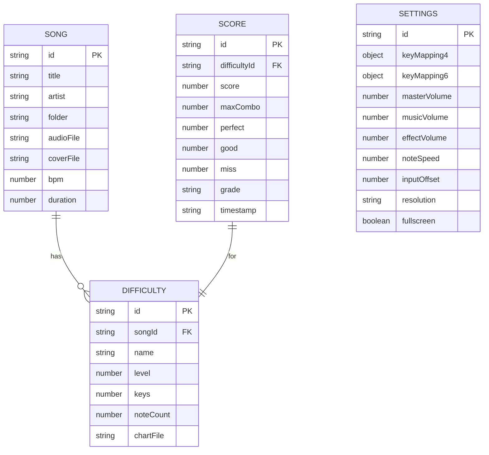
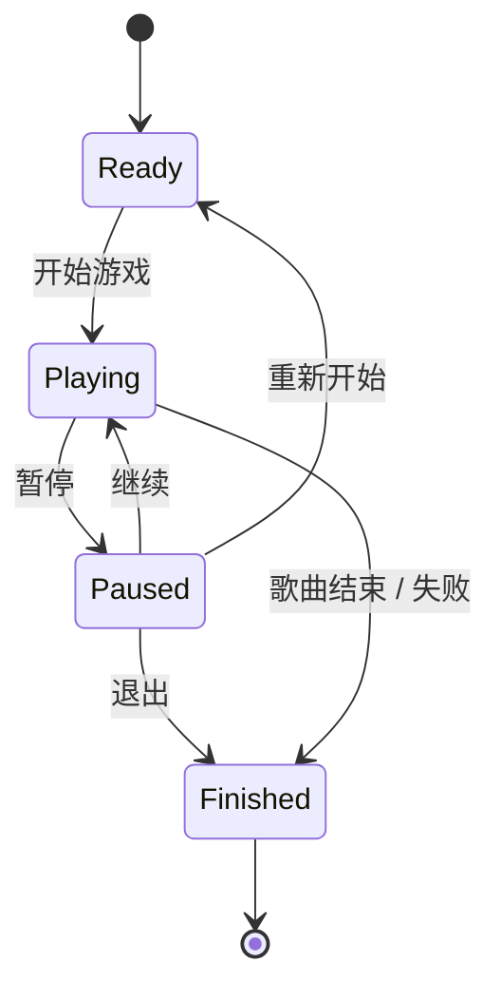

## 1. 架构设计



## 2. 技术描述

- **前端框架**: React@18 + TypeScript + Vite
- **桌面容器**: Electron@28
- **状态管理**: Zustand
- **样式方案**: TailwindCSS@3 + 自定义 CSS 变量
- **游戏渲染**: HTML5 Canvas 2D
- **音频处理**: Web Audio API
- **数据持久化**: Electron Store + JSON 文件
- **图标**: Lucide React

## 3. 项目结构

```
src/
├── components/          # React UI 组件
│   ├── SongSelect/      # 选歌界面
│   ├── DifficultySelect/ # 难度选择
│   ├── GamePlay/        # 演奏界面
│   ├── Result/          # 结算界面
│   ├── PackManager/     # 曲包管理
│   ├── Practice/        # 练习模式
│   └── Settings/        # 设置界面
├── game/                # 游戏引擎核心
│   ├── engine.ts        # 游戏主循环
│   ├── renderer.ts      # Canvas 渲染器
│   ├── judge.ts         # 判定系统
│   ├── input.ts         # 输入处理
│   └── audio.ts         # 音频系统
├── store/               # Zustand 状态管理
│   ├── gameStore.ts     # 游戏状态
│   ├── settingsStore.ts # 设置状态
│   └── songStore.ts     # 歌曲数据
├── parser/              # 谱面解析器
│   ├── jsonParser.ts    # JSON 谱面解析
│   └── osuParser.ts     # osu! 谱面解析
├── types/               # TypeScript 类型定义
│   ├── song.ts          # 歌曲/谱面类型
│   ├── game.ts          # 游戏类型
│   └── settings.ts      # 设置类型
├── utils/               # 工具函数
│   ├── file.ts          # 文件操作
│   ├── math.ts          # 数学计算
│   └── color.ts         # 颜色处理
├── assets/              # 静态资源
│   ├── fonts/           # 字体文件
│   └── skins/           # 皮肤资源
├── App.tsx              # 应用主组件
├── main.tsx             # React 入口
└── index.css            # 全局样式
```

## 4. 路由定义

| 路由 | 页面 | 说明 |
|-----|------|------|
| `/` | 选歌界面 | 默认页面，展示歌曲列表 |
| `/difficulty/:songId` | 难度选择 | 选择歌曲难度和键位模式 |
| `/play/:songId/:difficulty` | 演奏界面 | 游戏主界面 |
| `/result/:songId/:difficulty` | 结算界面 | 显示游戏成绩 |
| `/packs` | 曲包管理 | 管理本地曲库 |
| `/practice/:songId` | 练习模式 | 练习特定段落 |
| `/settings` | 设置界面 | 配置游戏参数 |

## 5. 数据模型

### 5.1 歌曲数据模型



### 5.2 谱面格式（JSON）

```typescript
interface Chart {
  version: string;
  song: {
    title: string;
    artist: string;
    bpm: number;
    offset: number;
  };
  difficulty: {
    name: string;
    level: number;
    keys: 4 | 6;
  };
  notes: {
    time: number;      // 毫秒
    lane: number;      // 0-3 或 0-5
    type: 'tap' | 'hold' | 'slide';
    duration?: number; // hold 持续时间
  }[];
  timingPoints?: {
    time: number;
    bpm: number;
  }[];
}
```

## 6. 游戏引擎架构

### 6.1 核心模块

1. **GameEngine** - 游戏主循环
   - `update(deltaTime)`: 更新游戏状态
   - `render()`: 渲染当前帧
   - `handleInput(event)`: 处理输入事件

2. **JudgeSystem** - 判定系统
   - `checkNoteHit(note, hitTime)`: 计算判定结果
   - `calculateScore(judgement)`: 计算得分

3. **NoteRenderer** - 音符渲染
   - `drawNotes(notes, currentTime)`: 绘制下落音符
   - `drawLanes()`: 绘制轨道
   - `drawJudgeLine()`: 绘制判定线

4. **AudioSystem** - 音频系统
   - `loadAudio(url)`: 加载音频
   - `play()`: 播放音乐
   - `getCurrentTime()`: 获取当前播放时间
   - `playHitSound()`: 播放打击音效

### 6.2 游戏状态流程



## 7. 性能优化

- **对象池**: 音符对象复用，避免频繁 GC
- **分层渲染**: 背景、音符、特效分层 Canvas
- **插值渲染**: 使用固定时间步长更新，插值渲染
- **离屏渲染**: 静态元素预渲染到离屏 Canvas
- **Web Worker**: 谱面解析在 Worker 线程进行
